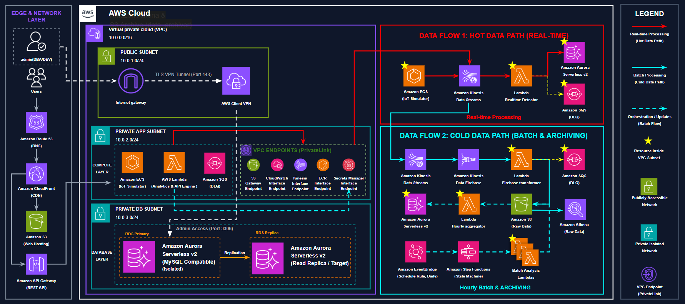
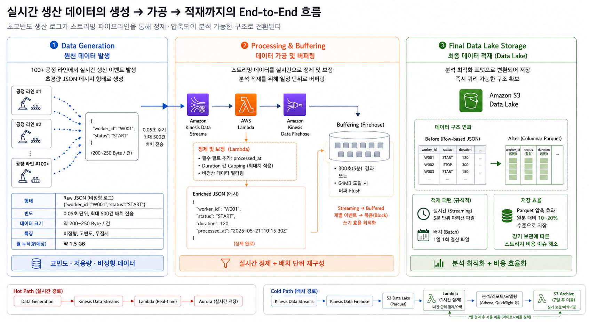

# Beyond Smart Factory
## 사람까지 이해하는 스마트팩토리 : 실시간 작업자 데이터 기반 AI 의사결정 플랫폼
> **Human-Centric Smart Factory with AWS Serverless & Medallion Architecture**

본 프로젝트는 수작업 의존도가 높은 노동 집약적 제조 현장을 위해 설계된 **실시간 데이터 파이프라인 및 지능형 의사결정 지원 시스템**입니다. 단순 관제를 넘어 작업자의 피로도와 설비 상태를 실시간으로 분석하여 사고를 예방하고 공정 배치를 최적화하는 '선제적 대응(Prescriptive)' 플랫폼을 지향합니다.

---
[📺 프로젝트 시연 영상 보러가기 (Google Drive)](https://drive.google.com/file/d/1xm1O9PbyzdicAZqnCw4m8yZFMN8BK1_-/view?usp=sharing)
---
### 🎯 Demo Checkpoints

  ✅ **Point 1. 무결성 보장 데이터 파이프라인** *(Zero Data Loss)*
  초 단위 스트리밍 처리 및 DLQ를 활용한 완벽한 장애 격리·재처리

  ✅ **Point 2. 예측형 인력 최적화** *(Predictive Optimization)*
  과거 데이터 기반 피로도 회귀 분석 및 AI 조합 추천 시뮬레이션

  ✅ **Point 3. 비용 효율적 분석 환경** *(Serverless & FinOps)*
  데이터 레이크(Athena) 기반 Ad-hoc 쿼리 분석 및 실시간 인프라 비용 통제 체계

---
## 🚀 Key Features

- **Human-Centric Monitoring**: 작업자의 실시간 숙련도와 체력 감쇄율(Fatigue Model)을 데이터화하여 분석.
- **Safety Interlock**: 설비 부하(`current_amp`) 및 공정 소요 시간(`duration`) 이상 감지 시 즉각적인 안전 알림 및 제어 로직 제공.
- **Medallion Architecture**: Raw 데이터부터 비즈니스 인사이트까지 3단계(Bronze, Silver, Gold) 데이터 정제 파이프라인 구축.
- **Serverless Scalability**: AWS Kinesis, Lambda 기반의 완전 서버리스 아키텍처로 트래픽 변화에 유연하게 대응하고 비용 최적화.
- **IaC (Infrastructure as Code)**: Terraform을 통한 인프라 프로비저닝 자동화로 신규 공정 확산성 확보.

---
## 🎯 Key Achievements

### 1. 🚀 AWS Serverless 기반 인프라 최적화 (TCO 절감)
- **Zero Idle Cost**: 공장 가동 시간(09:00~18:00) 외 유휴 시간에 비용이 발생하지 않도록 **Amazon ECS Fargate**와 **Aurora Serverless v2**를 도입하여 클라우드 자원을 효율적으로 운영했습니다.
- **월 유지비용 극대화**: 레거시 MES 대비 인프라 유지 관리 비용을 극적으로 절감하여 **월 예상 운영 비용 $102.8** 수준의 고효율 시스템을 완성했습니다.
- **IaC(Infrastructure as Code) 구축**: **Terraform**을 활용해 인프라 전체를 코드로 관리하며, 신규 생산 라인 추가 시 **10분 내에 동일한 아키텍처 환경을 완벽하게 프로비저닝 및 복제 전개**할 수 있는 파이프라인을 구축했습니다.

### 2. ⚡ 대용량 실시간 데이터의 안정적 처리 및 무결성 보장 (Zero Data Loss)
- **고가용성 스트리밍 아키텍처**: 초당 수백 건의 IoT 로그를 **Amazon Kinesis Data Streams**로 버퍼링하여 예측 불가능한 트래픽 스파이크 시에도 시스템 다운타임 없는 안정성을 확보했습니다.
- **데이터 멱등성(Idempotency) 보장**: 네트워크 지연에 따른 At-least-once 전송 중복 문제를 방어하기 위해, DB 레이어에서 **UPSERT Pattern (ON DUPLICATE KEY)** 및 Atomic Aggregation을 적용하여 데이터 정합성을 확보했습니다.
- **장애 격리 및 복구 (Fault Tolerance)**: 이상 데이터(Poison Pill) 유입 시 파이프라인 중단을 막기 위해 **Amazon SQS(DLQ)**로 격리하는 구조를 설계했으며, AWS Step Functions 백오프(BackoffRate=2.0) 재시도 로직과 UI 기반 원클릭 재처리(Replay) 환경을 구현했습니다.

### 3. 💾 메달리온 아키텍처 기반 데이터 레이크 및 성능 최적화
- **Medallion Architecture (Bronze-Silver-Gold)** 도입으로 실시간 원천 데이터(Raw)부터 비즈니스 인사이트 창출까지 3단계 정제 파이프라인을 구축했습니다.
- **비용 및 쿼리 성능 최적화 (FinOps)**: Kinesis Data Firehose를 통해 실시간 수집된 대규모 JSON 로그를 **Parquet 포맷으로 압축 변환**하여 Amazon S3에 적재했습니다.
- **정량적 성과**: 결과적으로 데이터 저장 공간을 **80% 절감 (50MB → 10MB)**하고, **Amazon Athena 쿼리 스캔 속도를 6.5배 향상 (5.2s → 0.8s)** 시켰습니다.
- **네트워크 보안 최적화**: VPC Endpoints (PrivateLink)를 적극 활용하여 S3, CloudWatch, Kinesis 등 주요 AWS 서비스 접근 시 퍼블릭 인터넷 구간을 거치지 않는 격리된 프라이빗 네트워크 환경을 구축했습니다.

---

## 🏗 System Architecture


### 🔄 메달리온 아키텍처
1. **Bronze (Raw)**: Kinesis를 통해 인입된 원천 JSON 로그를 S3에 불변(Immutable) 상태로 저장.
2. **Silver (Refined)**: Lambda 전처리를 통해 이상치를 보정하고, 쿼리 성능 최적화를 위해 Parquet 포맷으로 변환. (Athena 활용)
3. **Gold (Insight)**: 일일 정산 및 작업자 피로도 분석 결과가 반영된 데이터 마트. Aurora Serverless를 통해 대시보드 및 AI 엔진에 서빙.

### 🔄 Lambda 기반 듀얼 파이프라인 (Hot & Cold Path)
1. **Hot Path (Real-Time Processing)**
   - `Kinesis` ➔ `Lambda` ➔ `Aurora Serverless v2`
   - 실시간 병목 공정(WIP 과부하) 식별 및 작업자 이상 패턴(피로도 누적, 무리한 작업 등) 즉각 탐지 및 알림.
2. **Cold Path (Batch Processing & Archiving)**
   - `Firehose` ➔ `S3 (Parquet)` ➔ `Step Functions` ➔ `Athena`
   - 일일/주간 단위 숙련도 향상률 및 체력 감쇄 선형 회귀 분석.
   - 7일 경과 데이터는 S3 Archive 레이어로 이관(Data Archiver)하여 DB 부하를 차단하고 장기 보관 컴플라이언스를 준수했습니다.

---

## 📊 Data Payload Structure

실시간으로 수집되는 핵심 데이터 모델입니다.

| Field | Description | Business Logic |
| :--- | :--- | :--- |
| `worker_id` | 작업자 식별자 | 개인별 숙련도 및 누적 피로도 추적 |
| `line_id` | 생산 라인 위치 | 공정별 병목 구간 식별 |
| `status` | 공정 상태 (START/END) | 실시간 생산성 집계 및 지연 확인 |
| `current_amp` | 설비 전류 부하 | **끼임/충돌 등 산업재해 징후 탐지** |
| `duration` | 공정 소요 시간 | **작업자 집중력 저하 및 피로도 판단** |

---

## 🧠 핵심 알고리즘: AI 기반 예측형 인력 최적화

사후 대응(Reactive)에 머무는 기존 스마트팩토리(Level 2)를 넘어, 데이터를 기반으로 미래를 예측하고 제어하는 **최적화 단계(Level 4)**를 실현했습니다.

- **3차원 지표 결합 분석 (Potential Score 산출)**:
  - `숙련도 (Learning Curve)`: 작업자 과거 이력 기반 생산성 예측
  - `피로도 (Fatigue)`: 가동 시간 누적에 따른 집중력 및 체력 저하 선형 회귀 분석
  - `공정 난이도`: 기준 시간(SMV) 및 공정 내 이상치 발생 확률 평가
- **Human-in-the-loop (시뮬레이션 UI)**: 관리자가 대시보드에서 드래그 앤 드롭으로 가상 인력을 재배치하면, 시스템이 즉각적인 생산량 증감률(ROI)을 시뮬레이션하여 최적의 의사결정을 돕습니다.

---

## 🛠 사용 기술 (Tech Stack)

| Category | Technologies |
| :--- | :--- |
| **Compute / Logic** | AWS Lambda, Amazon ECS (Fargate), AWS Step Functions |
| **Data Streaming** | Amazon Kinesis Data Streams, Kinesis Data Firehose |
| **Data Store / Query** | Amazon Aurora Serverless v2 (MySQL), Amazon S3, Amazon Athena |
| **Messaging / Event** | Amazon SQS (DLQ), Amazon EventBridge |
| **Network & Security** | Amazon VPC, VPC Endpoints (PrivateLink), AWS Client VPN, IAM |
| **IaC / DevOps** | Terraform |
| **Language** | Node.js, Python, SQL |

---

## 🚀 향후 고도화 로드맵 (Future Evolution)

- **Phase 2 (Scaling)**: 확장 라인 대응을 위해 AWS EMR (Spark) 기반 대용량 로그 분산 처리 파이프라인 연계 및 AWS IoT Core 도입.
- **Phase 3 (Intelligence)**: 현재의 휴리스틱(Rule-based) 분석 모델을 넘어, Amazon SageMaker를 활용한 강화학습(RL) 기반 작업자 배정 최적화 알고리즘으로 고도화.
- **Phase 4 (Autonomous)**: IoT Greengrass를 활용한 엣지 컴퓨팅 기반 초저지연 현장 자율 제어 시스템 구현.

---

## 📂 Directory Structure

```text
├── terraform/          # IaC (Infrastructure as Code) 정적 자원 정의
├── lamda_backup/
│   ├── producers/      # IoT 센서 데이터 시뮬레이터 (Data Generation)
│   ├── consumers/      # Kinesis/Lambda 데이터 처리 로직
│   └── analytics/      # 분석 및 추천 알고리즘 (Potential Score)
├── app/                # SCADA 관제 대시보드 (Frontend) & 데이터 서빙 API 서버 (Backend)
│   # 클라이언트 요청을 받아 Aurora DB 및 S3 데이터를 조회·가공하여 반환
├── docs/               # 기획안 및 아키텍처 다이어그램
└── README.md
```

---
> 💡 **Project Contact & Author** > - **YONG (Yongrim Cho)** | 📧 limetry2392@gmail.com
